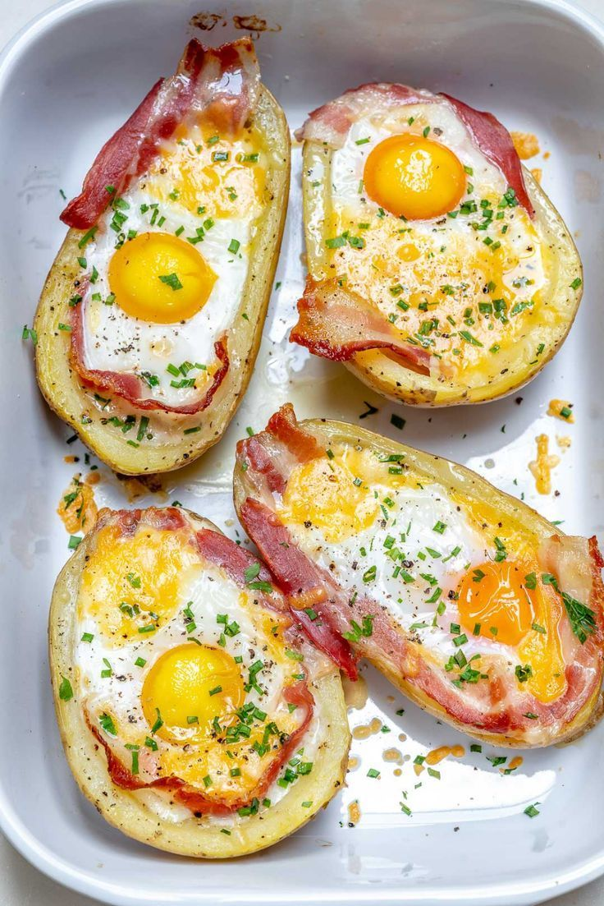

image2txt
=========

============
Introduction
============

The ``image2txt`` command allow to extract the colors from an image and write them into a color palette file (see :ref:`file_specification`).

    .. versionadded:: 0.7.0

        Added command ``image2txt``

=======
Example
=======

Given the file ``colors.png`` with the following image:

Let's generate a harmony file (see :ref:`file_specification`) with the color palette::

    $ harmony image2txt colors.png

And we generate a file ``colors.txt`` with the following content (see :ref:`file_specification`)::

    RGB(221, 228, 236) Alice Blue
    RGB(137, 144, 163) Manatee
    RGB(155, 166, 188) Rock Blue
    RGB(164, 172, 191) Echo Blue
    RGB(169, 178, 193) Mischka
    ...

=========
Arguments
=========

.. program:: harmony image2txt

.. option:: colors-file

    An image or a directory with images to extract colors (see :ref:`file_specification`).

    .. versionchanged:: 1.0.0

        Now directories are also accepted

=======
Options
=======

.. option:: --color-format <format>, -f <format>

    Default\: input. Determine the format the colors are going to be written in the output file:

    * input: The output format will be the same as the input format;
    * rgb: The output for all colors will be in RGB format;
    * hexcode: The output for all colors will be in Hexcode format;
    * hsl: The output for all colors will be in HSL format;

    .. versionadded:: 1.0.0

        Added ``--color-format`` option to ``image2txt``

    #######
    Example
    #######

    Given the file ``colors.png`` with the following image:

    .. image:: ../_static/images/image2txt-1.jpg

    Let's generate a harmony file (see :ref:`file_specification`) with the output color format set to ``rgb``::

        $ harmony image2txt colors.png -f rgb

    And we generate a file ``colors.txt`` with the following content (see :ref:`file_specification`)::

        #FFFFFF White
        HSL(205, 56%, 68%) Maya Blue
        RGB(230, 36, 36) Fire Brick
        #ff7381 Froly
        RGB(255, 115, 129) Froly
        #ff7381 Froly

    Now let's generate a harmony file (see :ref:`file_specification`) the output color format set to ``hexcode``::

        $ harmony image2txt colors.png -f hexcode

    And we generate a file ``colors.txt`` with the following content (see :ref:`file_specification`)::

        #FFFFFF White
        HSL(205, 56%, 68%) Maya Blue
        RGB(230, 36, 36) Fire Brick
        #ff7381 Froly
        RGB(255, 115, 129) Froly
        #ff7381 Froly

    Now let's generate a harmony file (see :ref:`file_specification`) the output color format set to ``hsl``::

        $ harmony image2txt colors.png -f hsl

    And we generate a file ``colors.txt`` with the following content (see :ref:`file_specification`)::

        #FFFFFF White
        HSL(205, 56%, 68%) Maya Blue
        RGB(230, 36, 36) Fire Brick
        #ff7381 Froly
        RGB(255, 115, 129) Froly
        #ff7381 Froly

    .. option:: --minimum-difference <difference> -m <difference>

    Default\: ``2.3``. Determine the minimum CIE76 distance [#CIE76]_ between each pair of colors extracted for them to be discarded. It needs to be a decimal number greater or equal to ``0``.

    .. versionadded:: 1.1.0

        Added ``--minimum-difference`` option to ``image2txt``

    #######
    Example
    #######

    Given the file ``colors.png`` with the following image:

    .. image:: ../_static/images/image2txt-1.jpg

    Let's generate a harmony file (see :ref:`file_specification`) with the minimum distance of ``2.3``::

        $ harmony image2txt colors.png

    And we generate a file ``colors.txt`` with the following content (see :ref:`file_specification`)::

        RGB(162, 165, 180) Mischka
        RGB(181, 190, 205) Link Water
        RGB(114, 111, 96) Flint
        ...
        RGB(216, 195, 70) Confetti
        RGB(143, 159, 27) Citron
        RGB(83, 119, 45) Green Leaf

    Now let's generate a harmony file (see :ref:`file_specification`) with the minimum distance set to ``15``::

        $ harmony image2txt colors.png -m15

    And we generate a file ``colors.txt`` with the following content (see :ref:`file_specification`)::

        RGB(236, 197, 4) Gold
        RGB(184, 68, 17) Rust
        RGB(192, 102, 39) Christine
        RGB(250, 219, 40) Golden Dream
        RGB(254, 192, 31) Moon Yellow
        RGB(190, 90, 15) Rust
        RGB(201, 83, 21) Rust
        RGB(232, 158, 1) Orange
        RGB(40, 74, 0) Olive
        RGB(247, 164, 0) Orange
        RGB(83, 119, 45) Green Leaf

.. option:: --recursively, -r

    Default\: ``False``. If a directory is passed, ``Harmony`` is going to read every image recursively inside the directory passed.

.. option:: --help

    Display the options and information about the command;

.. rubric:: Footnotes

.. [#CIE76] CIE. CIE publication 15.2. 2nd ed. (1986).