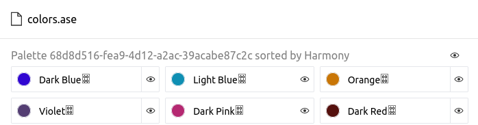

txt2ase
=======

============
Introduction
============

Converts a given color palette file (see :ref:`file_specification`) to Adobe ``.ase`` format.

.. versionadded:: 0.3.0

    Created the command with the name ``toase``

.. versionchanged:: 0.3.1

    Changed name of the command to ``txt2ase``

=======
Example
=======

Given the file ``colors.txt`` with the following content (see :ref:`file_specification`)::

    RGB(49, 6, 210) Dark Blue
    #0f8fb3 Light Blue
    RGB(201, 118, 6) Orange
    RGB(84, 62, 115) Violet
    #b52871 Dark Pink
    RGB(84, 16, 13) Dark Red

Let's convert it to a ``.ase`` file::

    $ harmony txt2ase colors.txt -n "awesome palette"

And we generate a file ``colors.ase`` [#paletteImporter]_:

=========
Arguments
=========

.. program:: harmony txt2ase

.. option:: colors-file

    The Harmony color palette file (see :ref:`file_specification`) to be converted to ``.ase`` format.

=======
Options
=======

.. program:: harmony txt2ase

    .. versionadded:: 0.3.0

.. option:: --palette-name <name>, -n <name>

    Default\: Palette ``ID generated with the uuid4 algorithm`` sorted by harmony. The name of the palette to be written to the ``.ase`` file.

    .. versionchanged:: 0.4.2

        Added short name ``-n``.

    #######
    Example
    #######

    Given the file ``colors.txt`` with the following content (see :ref:`file_specification`)::

        RGB(49, 6, 210) Dark Blue
        #0f8fb3 Light Blue
        RGB(201, 118, 6) Orange
        RGB(84, 62, 115) Violet
        #b52871 Dark Pink
        RGB(84, 16, 13) Dark Red

    Let's convert to a ``.ase`` file with the color palette name ``awesome palette``::

        $ harmony txt2ase colors.txt -n "awesome palette"

    And we generate a file ``colors.ase`` with the given palette name [#paletteImporter]_:

    .. image:: ../_static/images/txt2ase-1.png

.. option:: --suffix <suffix>, -s <suffix>

    The suffix to be append to the file's name.

    .. versionadded:: 1.0.0

        Added short name ``-s``.

    #######
    Example
    #######

    Given the file ``colors.txt`` with the following content (see :ref:`file_specification`)::

        RGB(49, 6, 210) Dark Blue
        #0f8fb3 Light Blue
        RGB(201, 118, 6) Orange
        RGB(84, 62, 115) Violet
        #b52871 Dark Pink
        RGB(84, 16, 13) Dark Red

    Let's sort with the suffix ``_example``::

        $ harmony txt2ase colors.txt -s _example

    And the output file will be called ``colors_example.ase``.

.. option:: --no-generate-color-names, -G
    
    Disables the color name generation for the unlabelled colors. Better demonstrated on :ref:`sort_command`.

    .. versionadded:: 0.5.0
        
        Added ``--no-generate-color-names`` option

.. option:: --help

    Display the options and information about the command;

.. rubric:: Footnotes

.. [#paletteImporter] Image taken using the `Palette Importer, Figma plugin by Michael Delaney and Sarah Stroschein <https://www.figma.com/community/plugin/1067561134666722782/Palette-Importer>`_.