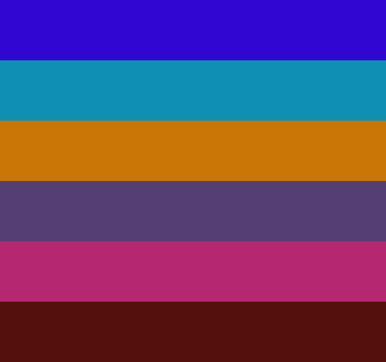

txt2image
=========

============
Introduction
============

The ``txt2image`` command allow to generate an image with the visual representation of a list of colors given a color palette file (see :ref:`file_specification`)

=======
Example
=======

Given the file ``colors.txt`` with the following content (see :ref:`file_specification`)::

    RGB(49, 6, 210) Dark Blue
    #0f8fb3 Light Blue
    RGB(201, 118, 6) Orange
    RGB(84, 62, 115) Violet
    #b52871 Dark Pink
    RGB(84, 16, 13) Dark Red

Let's generate a image with the color palette::

    $ harmony txt2image colors.txt

And we generate a file ``colors.png`` with the following image:

=========
Arguments
=========

.. program:: harmony image2txt

.. option:: image-file

    The image which will be used to extract the colors.

=======
Options
=======

.. option:: --help

    Display the options and information about the command;